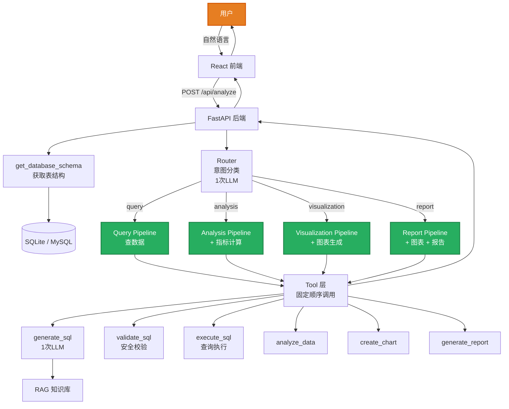

# DataPilot - 智能数据分析助手

基于 LLM 的中文数据分析工具，用自然语言提问，自动生成 SQL、执行查询、绘制图表、输出分析报告。

<!-- ════════════════════════════════════════ -->
<!--           👇 产品截图展示              -->
<!-- ════════════════════════════════════════ -->

<table>
  <tr>
    <td width="50%"></td>
    <td width="50%"></td>
  </tr>
  <tr>
    <td width="50%"></td>
    <td width="50%"></td>
  </tr>
  <tr>
    <td colspan="2" align="center"></td>
  </tr>
</table>

---

## 功能特性

- **自然语言查询**：用中文描述需求，自动分类意图并执行对应的分析流程
- **SQL 自动生成与执行**：根据数据库表结构自动生成 SQL，经过安全校验后执行
- **数据可视化**：自动选择合适的图表类型，用 ECharts 渲染交互式图表
- **分析报告生成**：支持生成包含 Summary、关键发现、行动建议的完整分析报告
- **多数据库支持**：内置 SQLite 示例数据库，也支持连接自己的 MySQL
- **业务知识注入**：通过 RAG 检索引擎在 SQL 生成时注入业务规则和指标定义

## 技术栈

| 层 | 技术 |
|----|------|
| **前端** | React 18 + TypeScript + Tailwind CSS + ECharts + Framer Motion |
| **后端** | Python 3.11 + FastAPI |
| **LLM** | DeepSeek (OpenAI 兼容 API) |
| **RAG** | scikit-learn TF-IDF + 余弦相似度 |
| **数据库** | SQLite（示例）/ MySQL（外部连接） |
| **打包** | PyInstaller 单文件 exe |

## 快速开始

### 方式一：源码运行

```bash
# 1. 安装 Python 依赖
pip install -r requirements.txt

# 2. 安装前端依赖并构建
npm install
npm run build

# 3. 配置 LLM API Key（二选一）
# 方式 A：环境变量
set LLM_API_KEY=your-api-key
set LLM_BASE_URL=https://api.deepseek.com

# 方式 B：启动后在界面设置页填入

# 4. 启动
python main.py
```

浏览器打开 `http://localhost:8080`，点击"连接示例数据库"即可使用。

### 方式二：运行打包后的 exe（如果有）

双击 `dist/DataPilot.exe`，在弹出的浏览器窗口中使用。

## 系统架构



核心流程：

1. 用户输入自然语言需求
2. **Router** 调用 LLM 进行意图分类（query / analysis / visualization / report）—— **第 1 次 LLM 调用**
3. 分派到对应的 **Pipeline**，Pipeline 按**固定顺序**调用工具（代码写死，非 LLM 决策）
4. SQL 生成步骤调用 LLM —— **第 2 次 LLM 调用**（仅此一步）
5. SQL 校验失败时自动重试一次（带错误上下文重新生成）
6. 整个请求**仅 2 次 LLM 调用**（分类 + SQL 生成），稳定、可预测、省钱

### Pipeline 路由

| Pipeline | 执行步骤 | LLM 调用 |
|----------|---------|----------|
| **query** | Schema → SQL → Validate → Execute | 2 次 |
| **analysis** | + analyze（统计指标计算） | 2 次 |
| **visualization** | + create_chart（图表生成） | 2 次 |
| **report** | + analyze + create_chart + generate_report | 2 次 |

### 扩展 Pipeline

新增分析类型只需两步：

```python
# backend/pipelines/new_type.py
class NewPipeline(BasePipeline):
    name = "new_type"
    label = "新分析类型"

    def execute(self, state):
        self._run_query_chain(state)  # 复用标准查询链路
        # ... 自定义后续步骤
        return state

# backend/pipelines/__init__.py
ALL_PIPELINES["new_type"] = NewPipeline()
```

## 项目结构

```
DataPilot/
├── main.py                       # 入口：FastAPI + 静态文件挂载
├── backend/
│   ├── api/main.py               # API 端点
│   ├── agents/state.py           # AgentState 共享状态
│   ├── pipelines/                # Pipeline 固定流水线
│   │   ├── base.py               #   基类 + 标准查询链路
│   │   ├── query.py              #   数据查询
│   │   ├── analysis.py           #   数据分析
│   │   ├── visualization.py      #   数据可视化
│   │   └── report.py             #   商业报告
│   ├── skills/                   # Router 意图分类器
│   │   └── router.py             #   LLM 分类 → Pipeline 分派
│   ├── tools/                    # Tool 层
│   │   ├── base.py               # BaseTool & LLM 调用
│   │   ├── schema_tool.py        # 表结构获取
│   │   ├── sql_generation_tool.py# SQL 生成
│   │   ├── sql_validator_tool.py # SQL 安全校验
│   │   ├── sql_execute_tool.py   # SQL 执行
│   │   ├── data_analysis_tool.py # 指标计算
│   │   ├── chart_tool.py         # 图表生成
│   │   └── report_tool.py        # 报告生成
│   ├── rag/                      # RAG 知识层
│   │   ├── retriever.py          # TF-IDF 检索引擎
│   │   └── knowledge/            # 知识库文件
│   └── database/
│       ├── connector.py          # 数据库连接层
│       └── sample_db.py          # 示例数据生成
├── src/                          # 前端 React
│   ├── pages/
│   │   ├── AnalysisPage.tsx      # 主对话页面
│   │   ├── IntroPage.tsx         # 项目介绍
│   │   └── ArchitecturePage.tsx  # 架构展示
│   ├── components/               # UI 组件
│   ├── hooks/useAgentRun.ts      # 分析生命周期
│   └── api/db.ts                 # API 封装
├── requirements.txt
└── package.json
```

## API 端点

| 方法 | 路径 | 说明 |
|------|------|------|
| GET | `/api/ping` | 健康检查 |
| POST | `/api/connect` | 连接数据库（MySQL） |
| POST | `/api/connect/sample` | 连接示例数据库 |
| GET | `/api/tables` | 获取数据库表列表 |
| GET | `/api/status` | 获取连接状态 |
| POST | `/api/disconnect` | 断开数据库 |
| POST | `/api/config/llm` | 设置 LLM API 配置 |
| POST | `/api/analyze` | 自然语言分析（核心接口） |
| POST | `/api/query` | 直接执行 SQL |
| POST | `/api/test/llm` | 测试 LLM 连接 |

## 示例数据库

内置电商场景示例数据，包含 4 张表：

- **users**（200 条）：用户信息（姓名、城市、注册时间）
- **products**（20 条）：商品信息（名称、品类、价格、库存）
- **orders**（800 条）：订单记录（用户、商品、金额、状态、时间）
- **reviews**（~500 条）：商品评价（评分、内容）

可以尝试这些问题：

- "总共有多少用户？"
- "卖得最好的品类是哪个？"
- "画出各城市的销售分布饼图"
- "帮我写一份本月经营分析报告"

## 关键设计决策

### Router + Pipeline 架构（2 次 LLM 调用）

SQL 数据分析是确定性流水线（查结构→写 SQL→校验→执行），步骤不可变序、不可跳过。因此**不用 ReAct Agent**（LLM 每步决策浪费 token），改用 **Router 意图分类 + Pipeline 固定执行**。

- Router：1 次 LLM 分类用户意图（4 类），选对 Pipeline
- Pipeline：代码按序调 tool，只在 SQL 生成步骤调 1 次 LLM
- 结果：**每次请求仅 2 次 LLM 调用**，比 Agent 模式少 50-70%，更快更稳更省

### SQL 校验失败自动重试

校验失败时，将错误信息作为上下文重新生成 SQL，最多重试 1 次。两步防御确保落库安全。

### 轻量 RAG 而非向量数据库

知识库体量小（~20 个片段），TF-IDF + 余弦相似度足够。省掉了嵌入模型和额外服务进程，打包 exe 零额外依赖。

### 最小依赖原则

LLM 调用用标准库 urllib 而不是 requests/httpx，避免 PyInstaller 打包时的隐式依赖问题。整个项目 Python 依赖仅 6 个包。

### SQL 安全双重防御

Prompt 层约束（只生成 SELECT）+ 代码层正则拦截（10 种危险关键字），两层独立生效。

## 未来计划

- [ ] 多轮对话记忆，支持上下文追问
- [ ] SQL 执行错误自动修复
- [ ] 支持 PostgreSQL、ClickHouse
- [ ] 用户自定义知识库上传
- [ ] 定时任务与数据预警
- [ ] SQL 准确率自动化评测

## License

MIT
